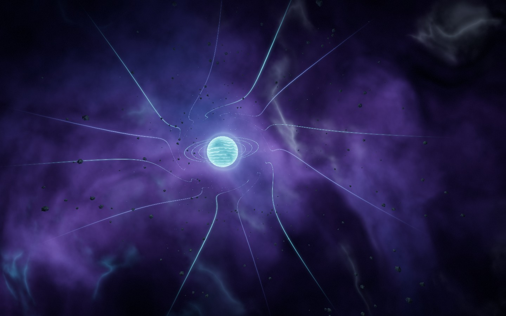
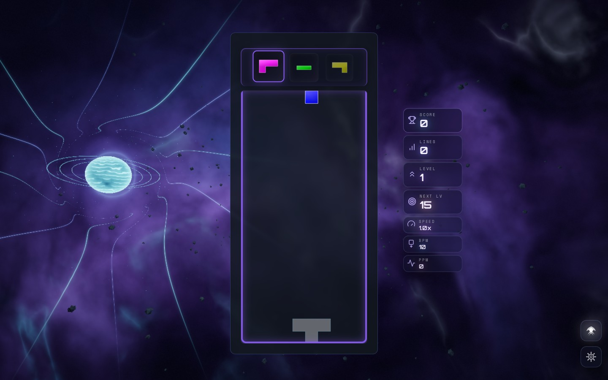

# Stellar Velocity visual overhaul

The previous scene used broad additive rainbow sheets and overlapping line and
wireframe overlays. The replacement gives the journey a coherent cyan/violet
palette, layered nebula density, flowing plasma filaments, a textured stellar
core, and radial star trails. The destination sits beside the desktop board and
above the portrait board. All six quality tiers share the same atmosphere.

## Captures

These are rendered screenshots, encoded as JPEG for repository size. Paused
captures use seed 187 and theme time 8 seconds. Companion JSON files record the
renderer diagnostics and console checks.

| Capture | Renderer / scenario |
| --- | --- |
| [Previous scene](before-webgl2.jpg) | WebGL2, original High theme |
| [Stellar destination](webgpu-idle.jpg) | Native WebGPU, High, GPU starfield compute and selective MRT bloom enabled |
| [Hyperdrive](hyperdrive.jpg) | Node WebGL2, High, combo 8, FTL transit |
| [Production game](game-desktop.jpg) | Production build, node WebGL2, High, real solo board and HUD |
| [Portrait](portrait-low.jpg) | Node WebGL2, Low, 390 × 844, four-line clear, board placement guide |





## Reproduction

Run `npm run dev:playground`, then open:

```text
/playground.html?effect=stellar-velocity&orbit=0&t=8&seed=187&quality=High&compute=1&mrt=1
/playground.html?effect=stellar-velocity&orbit=0&t=8&seed=187&quality=High&forceWebGL=1&event=combo&combo=8&eventAge=1.5
/playground.html?effect=stellar-velocity&orbit=0&t=8&seed=187&quality=Low&forceWebGL=1&board=1&event=tetris&eventAge=1.6
```

Use a fresh page load for each fixed-time capture. The portrait guide models the
solo board dimensions; the desktop production capture verifies the real layout.
Native WebGPU was verified through an offscreen render target and GPU readback
on the software Vulkan adapter: compute, TSL, MRT, and postprocessing all ran with
no validation errors. GPU twinkle phase after eight seconds matched the expected
radians-per-second value within 0.000083 radians. Software-adapter verification
does not establish frame-rate performance on physical GPUs.

## Validation

- Full suite: 519 test files, 5,508 tests passed before the final compute timing
  correction and native-device capability regression test.
- Final focused checks: 56 tests passed, covering atmosphere ownership and quality
  tiers, renderer parity, hidden-frame scheduling, and the r186 compute contract.
- Typecheck, production build, lint ratchet, architecture fitness, and dependency
  boundaries passed.
- Final native WebGPU and WebGL2 desktop/portrait captures had no console errors
  or warnings.

The nebula requires one draw; all plasma lanes share one instanced draw. The
periodic density texture is baked once and disposed with the atmosphere, rather
than evaluating expensive shader noise every frame.
