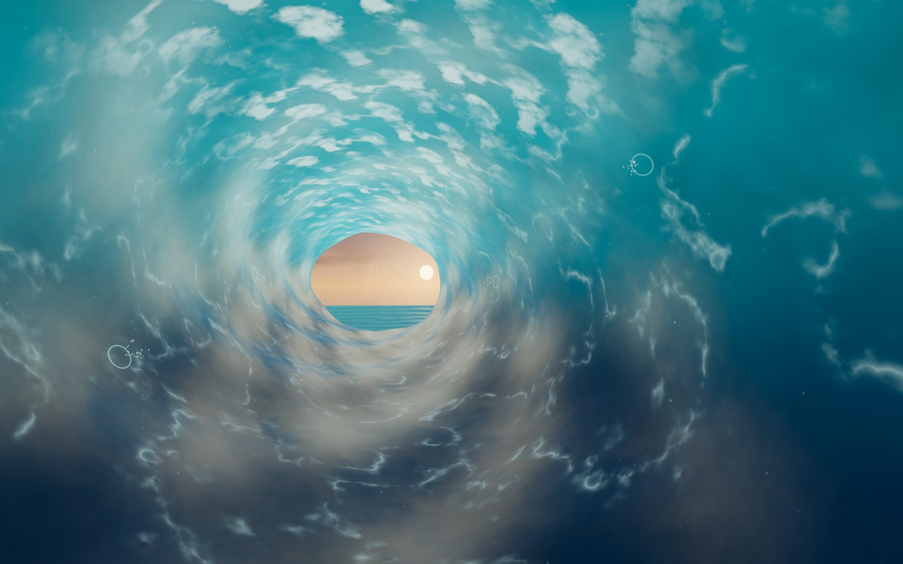
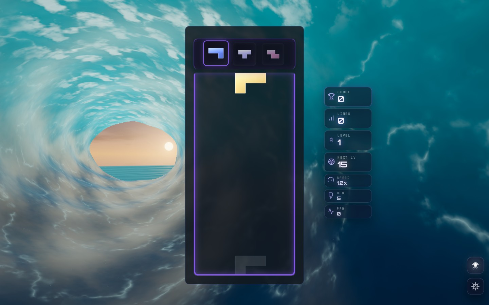

# Waves visual and event overhaul

Waves now uses a sculpted turquoise surf barrel, flowing water filaments,
crest foam, a layered sunset over the open sea, suspended salt spray, and
soft light shafts. Analytic water normals follow the displaced surface;
impact rings and droplets use that same surface instead of a fixed cylinder.
The opening sits beside the desktop board. On phones, its light is anchored in
the top margin measured from the real card, including almost full-screen boards.

The scene uses Three.js 0.186.1 node materials on native WebGPU and the node
WebGL2 fallback. High tiers use restrained bloom and an ocean color grade;
native WebGPU blooms explicit emission through MRT. Low and Minimal retain
the scene and event layers while rendering directly without post targets.

## Gameplay reactions

| Trigger | Response |
| --- | --- |
| Piece lock | An expanding wall ripple and a short droplet splash, on the correct screen side for the piece origin |
| Line clear | Staggered wall splashes, extra falling crest foam, and a swell that travels toward the opening |
| Combo | Stronger spray and foam, a larger travelling swell, and warmer shafts through the opening |

Reactions decay in seconds and use fixed quality budgets. Delayed impacts use
simulation time, so pausing freezes the complete effect. Rapid clears preserve
an active swell and coalesce one successor; full impact pools retire their oldest
slot. Large combos continue to scale smoothly while lighting stays bounded.
The previous broad white combo flash and wall-clipping shafts are removed.

## Captures

These are actual rendered screenshots, encoded as JPEG for repository size.
Companion JSON files preserve renderer, event, console, and lifecycle checks.
The deterministic scene captures use seed 187 and theme time 8 seconds.

| Capture | Renderer / scenario |
| --- | --- |
| [Previous idle](before-idle.jpg) | Original classic WebGL2 theme, High |
| [Previous combo](before-combo.jpg) | Original combo lighting |
| [Sunlit barrel](webgpu-idle.jpg) | Native WebGPU, High, selective MRT bloom |
| [Combo splashes](webgpu-combo.jpg) | Native WebGPU, combo 7 at 0.35 seconds |
| [Production desktop](production-desktop-idle.jpg) | Built game, node WebGL2, High, real solo board and HUD |
| [Production lock](production-desktop-lock.jpg) | Canonical gameplay callback, wall ripple and droplets |
| [Production four-line clear](production-desktop-tetris.jpg) | Canonical gameplay callback, travelling swell and staggered impacts |
| [Production combo](production-desktop-combo.jpg) | Canonical combo 7 callback |
| [Production portrait](production-portrait-tetris.jpg) | Built game, node WebGL2, Low, 390 × 844, real board |





## Reproduction

Run `npm run dev:playground` and open one effect at a time:

```text
/playground.html?effect=waves&orbit=0&t=8&seed=187&quality=High
/playground.html?effect=waves&orbit=0&t=8&seed=187&quality=High&forceWebGL=1&event=combo&combo=7&eventAge=0.35
/playground.html?effect=waves&orbit=0&t=8&seed=187&quality=Low&forceWebGL=1&board=1&event=tetris&eventAge=0.35
```

The playground imports the production scene, director, and post modules.
Repeated and backward seeks replay identical event state. `board=1` supplies
a placement guide; the production captures verify the real board and HUD.
Native WebGPU was verified on a software Vulkan adapter with offscreen GPU
readback, selective MRT, and zero validation errors. This verifies correctness,
not frame-rate performance on physical GPUs.

## Validation

- Full suite before the final phone framing adjustment: 523 files, 5,571 tests passed.
- Final focused suite: 57 Waves tests passed after that adjustment.
- Typecheck, production build, scoped lint, lint ratchet, architecture fitness,
  dependency boundaries, and theme lifecycle audit passed.
- Native WebGPU captures: no console warnings/errors or GPU validation errors.
  Combo 7 raised mean peak brightness by 1.83%; clipped-white fraction remained zero.

The focused tests exercise event timing at 30/60/144 Hz, event storms on all six
quality tiers, camera-projected origins, swell continuity, scene construction,
node/MRT contracts, owned resource disposal, stale initialization, pause/resume,
quality rebuilding, static container preservation, and deterministic seeking.

Production checks cover the canonical game callbacks, pause and paused-event
rejection, resume heartbeat, deferred quality changes, idempotent restart, and
switching to Forest and back with one live Waves canvas. Both desktop and
portrait runs pass all 14 checks with no errors or shader warnings. Each run
records two expected BaseTheme notices when deliberately restarting for quality
changes. Screenshots wait for the existing theme opacity fade to finish. The ocean uses seven
instanced/mesh draws; High adds the post pipeline. Texture noise is baked once
and released with the scene, keeping the per-frame shader work predictable.
